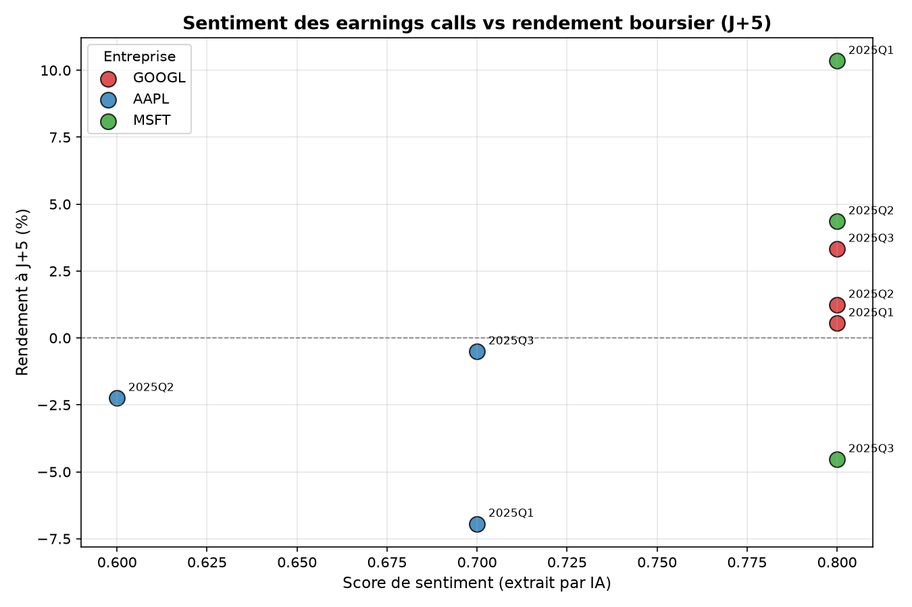

# 📊 Earnings Sentiment Tracker

**Un outil IA qui analyse le ton des dirigeants d'entreprises lors des earnings calls (conférences de résultats trimestriels) et teste si ce ton prédit le mouvement du cours de l'action.**

Ce projet combine extraction de données financières, traitement du langage naturel (LLM), et analyse statistique pour répondre à une question simple : **est-ce que le discours d'un PDG en dit plus sur l'avenir de son entreprise que ses chiffres ?**

---

## 🧭 Sommaire

- [Pourquoi ce projet](#-pourquoi-ce-projet)
- [Comment ça marche](#-comment-ça-marche)
- [Résultats](#-résultats)
- [Stack technique](#-stack-technique)
- [Installation](#-installation)
- [Structure du projet](#-structure-du-projet)
- [Limites connues](#-limites-connues-et-pistes-damélioration)
- [Glossaire](#-glossaire-pour-les-non-financiers)

---

## 🎯 Pourquoi ce projet

Quatre fois par an, chaque grande entreprise cotée en bourse organise un appel téléphonique public où son PDG et son directeur financier présentent les résultats du trimestre et répondent aux questions des analystes financiers. C'est un moment très surveillé par les marchés : la façon dont les dirigeants s'expriment (confiants, prudents, hésitants) est souvent scrutée autant que les chiffres eux-mêmes.

Ce projet automatise cette analyse : au lieu qu'un humain lise ou écoute chaque transcription, une IA le fait, extrait un score de ton, puis on vérifie statistiquement si ce score est lié au mouvement du cours de l'action qui a suivi.

**Ce projet a été conçu comme un exercice de rigueur méthodologique autant que technique** : plutôt que de chercher un résultat "impressionnant" à tout prix, l'objectif était de tester une hypothèse honnêtement, avec les bons outils statistiques, et d'en tirer des conclusions nuancées — comme le ferait un analyste dans un contexte professionnel.

---

## ⚙️ Comment ça marche

Le pipeline se déroule en 5 étapes :

```
1. Récupération   → Télécharger la transcription de l'earnings call (texte brut)
2. Analyse IA      → Un LLM (Llama 3.3 70B via Groq) lit le texte et extrait :
                      le ton général, un score numérique, et des phrases clés
3. Comparaison     → Comparer le ton d'un trimestre à celui du trimestre précédent
4. Rendement       → Récupérer le prix de l'action avant/après l'annonce
5. Corrélation     → Calculer si le score de sentiment est statistiquement
                      lié au rendement boursier
```

### Détail de l'étape IA

Le texte de la transcription est envoyé à un modèle de langage (LLM) avec des instructions précises lui demandant de retourner une analyse structurée au format JSON :

```json
{
  "ton_general": "confiant",
  "score_sentiment": 0.8,
  "changement_guidance": "maintenue",
  "phrases_cles": ["nous avons vu une accélération de la croissance..."],
  "langage_couverture": ["nous pensons", "sous réserve de"]
}
```

Cette sortie structurée est ensuite validée automatiquement par un schéma de données strict (via la librairie Python Pydantic), ce qui garantit que le format est toujours correct avant d'être utilisé dans le reste du pipeline.

---

## 📈 Résultats

### Échantillon testé

3 entreprises technologiques américaines (Apple, Microsoft, Alphabet/Google), sur 3 trimestres chacune (9 observations au total, année 2025).

| Entreprise | Trimestre | Score sentiment | Rendement à J+1 | Rendement à J+5 |
|---|---|---|---|---|
| GOOGL | Q1 | 0.8 | +1.68% | +0.55% |
| GOOGL | Q2 | 0.8 | +1.02% | +1.24% |
| GOOGL | Q3 | 0.8 | +2.52% | +3.33% |
| AAPL | Q1 | 0.7 | -3.74% | -6.94% |
| AAPL | Q2 | 0.6 | -2.50% | -2.24% |
| AAPL | Q3 | 0.7 | -0.38% | -0.50% |
| MSFT | Q1 | 0.8 | +7.63% | +10.35% |
| MSFT | Q2 | 0.8 | +3.95% | +4.36% |
| MSFT | Q3 | 0.8 | -2.92% | -4.53% |

### Visualisation



### Analyse statistique (corrélation de Pearson)

| Horizon | Coefficient (r) | p-value | Conclusion |
|---|---|---|---|
| J+1 | 0.581 | 0.101 | Pas significatif (p > 0.05) |
| J+5 | 0.485 | 0.186 | Pas significatif (p > 0.05) |

**Interprétation honnête :** on observe une tendance positive modérée — un ton plus confiant est *associé* à un rendement légèrement meilleur — mais avec seulement 9 observations, ce résultat n'atteint pas le seuil de significativité statistique généralement admis (p < 0.05). Il faudrait un échantillon nettement plus large (30+ observations, idéalement sur plusieurs années et secteurs) pour tirer une conclusion fiable.

**Observation notable :** le score de sentiment brut varie très peu (entre 0.6 et 0.8 sur l'ensemble de l'échantillon). C'est cohérent avec un biais bien documenté en finance comportementale : les dirigeants d'entreprise ont structurellement tendance à maintenir un discours positif, même lors de trimestres décevants. Cela suggère que le score de sentiment seul est un signal faible, et que des variables plus fines (comme le changement de guidance ou la densité de langage prudent) pourraient être plus discriminantes — voir la section [Limites](#-limites-connues-et-pistes-damélioration).

---

## 🛠️ Stack technique

| Composant | Outil utilisé | Pourquoi |
|---|---|---|
| Récupération des transcriptions | [Alpha Vantage API](https://www.alphavantage.co/) | Gratuit, historique complet, structuré par intervenant |
| Analyse de sentiment | [Groq API](https://groq.com/) (Llama 3.3 70B) | Gratuit, rapide, mode JSON structuré |
| Données boursières | [yfinance](https://github.com/ranaroussi/yfinance) | Gratuit, sans clé API, fiable |
| Validation des données | [Pydantic](https://docs.pydantic.dev/) | Garantit la cohérence du format à chaque étape |
| Analyse statistique | [SciPy](https://scipy.org/), [pandas](https://pandas.pydata.org/) | Corrélation de Pearson, manipulation de données |
| Visualisation | [Matplotlib](https://matplotlib.org/) | Graphique sentiment vs rendement |

**100% du projet fonctionne avec des API gratuites**, sans carte bancaire — un choix délibéré pour que n'importe qui puisse reproduire ou étendre ce projet sans barrière financière.

---

## 🚀 Installation

### 1. Cloner le repo

```bash
git clone https://github.com/karimcsss/earnings-sentiment-tracker.git
cd earnings-sentiment-tracker
```

### 2. Créer l'environnement virtuel

```bash
python -m venv .venv
.venv\Scripts\activate   # Windows
```

### 3. Installer les dépendances

```bash
pip install -r requirements.txt
```

### 4. Obtenir les clés API gratuites

- **Alpha Vantage** : [alphavantage.co/support/#api-key](https://www.alphavantage.co/support/#api-key) (email suffit)
- **Groq** : [console.groq.com/keys](https://console.groq.com/keys) (email suffit)

Crée un fichier `.env` à la racine avec :
```
ALPHA_VANTAGE_API_KEY=ta_cle_ici
GROQ_API_KEY=ta_cle_ici
```

### 5. Lancer le pipeline complet

```bash
python -m backtest.executer_pipeline_complet
python -m backtest.analyser_correlation
python -m backtest.generer_graphique
```

---

## 📁 Structure du projet

```
earnings-sentiment-tracker/
├── models/
│   └── schema.py                    # Modèles de données (Pydantic)
├── collecte/
│   ├── recuperer_transcripts.py     # Récupération des transcriptions (Alpha Vantage)
│   ├── recuperer_dates_earnings.py  # Dates de publication des résultats
│   └── cache.py                     # Cache local pour économiser le quota API
├── analyse/
│   ├── extraire_sentiment.py        # Extraction de sentiment via LLM (Groq)
│   └── comparer_trimestres.py       # Comparaison trimestre sur trimestre
├── backtest/
│   ├── evaluer_correlation.py       # Calcul des rendements boursiers (yfinance)
│   ├── executer_pipeline_complet.py # Orchestration multi-entreprises
│   ├── analyser_correlation.py      # Corrélation statistique (Pearson)
│   └── generer_graphique.py         # Visualisation
├── data/
│   ├── transcripts/                 # Cache des transcriptions (versionné pour reproductibilité)
│   └── resultats/                   # Résultats du backtest (CSV + graphique)
├── requirements.txt
└── .env                             # Clés API (non versionné)
```

---

## 🔍 Limites connues et pistes d'amélioration

Ce projet est une V1 volontairement ciblée. Voici ses limites assumées et les pistes pour aller plus loin :

- **Échantillon restreint (9 observations)** : un secteur (tech), 3 entreprises, 3 trimestres. Une V2 étendrait à 15-20 entreprises sur plusieurs secteurs et années pour une significativité statistique réelle.
- **Score de sentiment peu discriminant** : le ton des dirigeants variant peu (toujours globalement positif), un signal plus fin comme le `changement_guidance` (relevée/maintenue/abaissée) ou la densité de `langage_couverture` (expressions prudentes) pourrait mieux capter les nuances.
- **Rendement brut, non ajusté au marché** : les rendements utilisés ne sont pas corrigés des mouvements du marché global (S&P 500) ni du secteur — une entreprise peut monter simplement parce que tout le marché monte ce jour-là. Une V2 calculerait un "rendement anormal" (alpha) pour isoler l'effet propre à l'annonce.
- **Pas de contrôle sur les surprises de résultats** : le marché réagit souvent à l'écart entre résultats réels et attentes des analystes (« earnings surprise »), pas seulement au ton employé. Croiser avec des données de consensus analystes enrichirait l'analyse.
- **Une seule requête LLM par transcription** : pas de vérification croisée entre plusieurs runs ou plusieurs modèles, ce qui limiterait le bruit dans l'extraction.

---

## 📚 Glossaire (pour les non-financiers)

Ce projet touche à des concepts de finance de marché. Voici les termes essentiels, expliqués simplement.

**Earnings call** — Une conférence téléphonique trimestrielle où le PDG (CEO) et le directeur financier (CFO) d'une entreprise cotée en bourse présentent leurs résultats financiers aux investisseurs et analystes, puis répondent à leurs questions. C'est un événement très surveillé, qui peut faire bouger le cours de l'action.

**Guidance (prévisions)** — Les objectifs chiffrés que l'entreprise donne elle-même pour l'avenir (ex : « on prévoit 5% de croissance le trimestre prochain »). Elle peut être *relevée* (objectifs plus ambitieux, signal positif), *maintenue*, ou *abaissée* (objectifs réduits, souvent mal perçu par le marché).

**Sentiment / ton du management** — L'état d'esprit général exprimé par les dirigeants pendant l'appel : confiant, prudent, neutre, ou inquiet. Le *score de sentiment* est une version chiffrée de ce ton (ici, de -1 à +1), pour pouvoir le comparer facilement dans le temps ou entre entreprises.

**Langage de couverture (hedging language)** — Des expressions volontairement prudentes utilisées pour ne pas s'engager fermement (« nous pensons », « sous réserve de », « nous estimons »). Plus il y en a, plus l'entreprise semble incertaine de l'avenir, même si le ton général paraît positif.

**Rendement (return)** — La variation en pourcentage du prix d'une action sur une période donnée. Dans ce projet, on regarde le rendement à J+1 (1 jour après l'earnings call) et à J+5 (5 jours après), pour voir si le marché a réagi positivement ou négativement.

**Backtest** — Un test rétrospectif : on utilise des données historiques pour vérifier si un signal ou une stratégie aurait fonctionné dans le passé. Ça ne garantit pas que ça marchera dans le futur, mais c'est une première étape de validation, standard en recherche financière.

**Corrélation (coefficient de Pearson, noté *r*)** — Une mesure statistique de si deux variables évoluent ensemble. *r* varie de -1 (elles évoluent en sens opposé) à +1 (elles évoluent exactement ensemble), 0 signifiant aucun lien. Ici, on mesure si un sentiment plus positif est associé à un meilleur rendement.

**P-value** — Une mesure de la fiabilité statistique d'un résultat. Plus elle est basse, plus on peut être confiant que la corrélation observée n'est pas due au hasard. Le seuil communément admis pour parler de résultat "significatif" est p < 0.05 (5% de risque de se tromper).

**LLM (Large Language Model)** — Un modèle d'intelligence artificielle entraîné à comprendre et générer du texte (comme ChatGPT ou Claude). Ici, il est utilisé pour lire les transcriptions et en extraire une analyse structurée.

**API (Application Programming Interface)** — Un moyen pour un programme d'aller chercher automatiquement des données ou services chez un fournisseur externe (ici : transcriptions financières, cours de bourse, ou réponses d'un modèle d'IA), sans intervention humaine manuelle.

---

## 👤 Auteur

Karim — [github.com/karimcsss](https://github.com/karimcsss)
Projet réalisé dans le cadre d'un portfolio en IA/finance appliquée.